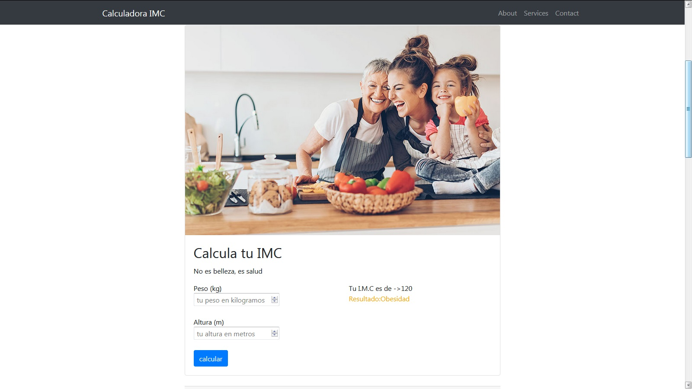

#  sobre el proyecto Calculadora-imc-php-bootstrap
 Este es un proyecto personal que utliza  las siguientes tecnologias:PHP,SQL,HTML5,CSS3,BOOTSTRAP
 
 ---------------
### 💿 Tecnologias
-----------------------
En este proyecto se utlizaron las siguientes tecnologias:
- [bootstrap 4](https://getbootstrap.com/)
- php 7
- html5
- css3
- sql

### 🛠️ Funcionalidades
----------------------- 
Este proyecto de e-comerce en php permite al usuario 
1-Agregar y eliminar producto  
2-leer y actualizar producto en una sgbd

### :computer: Captura de pantalla
 ----------------------- 

### 🛠️ Instalacion
---------------
1. hacer download del archivo .zip
2. instalar un servidor local como **MAMP,LAMP O XAMMP**,en caso de tener instalado colocar los archivos en la carpeta por ej: MAMP/htdocs
3. Para ejecutar en el navegador localhost:8080/MAMP/htdocs/nombre-carpeta/index.html
4. O git clone mas URL del repositorio

### ✔ Status
---------------
Proyecto terminado

----------------------- 
### Licencia

-----------------------
### 📕 Autor
---------------
Bernardo Alvez Gil

### 🎁 Contenido
---------------

1. Sobre el proyecto
2. Tecnologias
3. Funcionalidades
4. Captura de pantalla
5. Instalacion
6. Status
7. Licencia
8. Contenido
9. Autor
 

